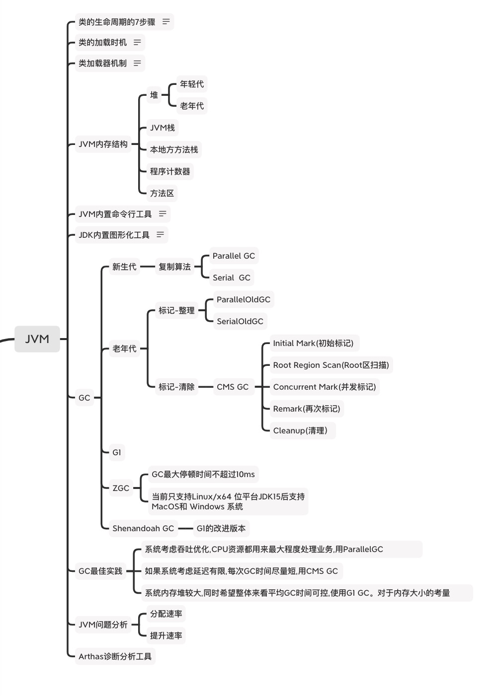
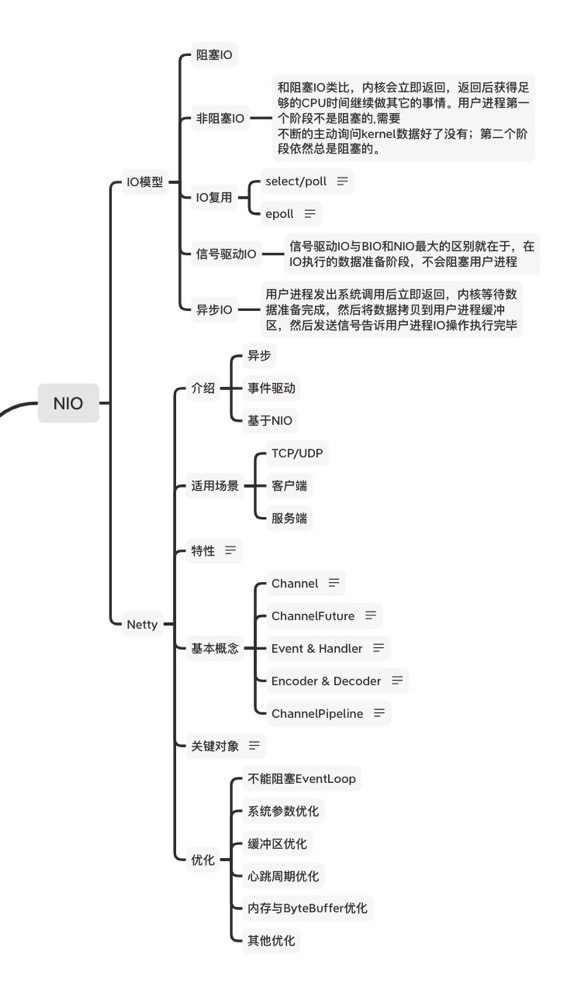
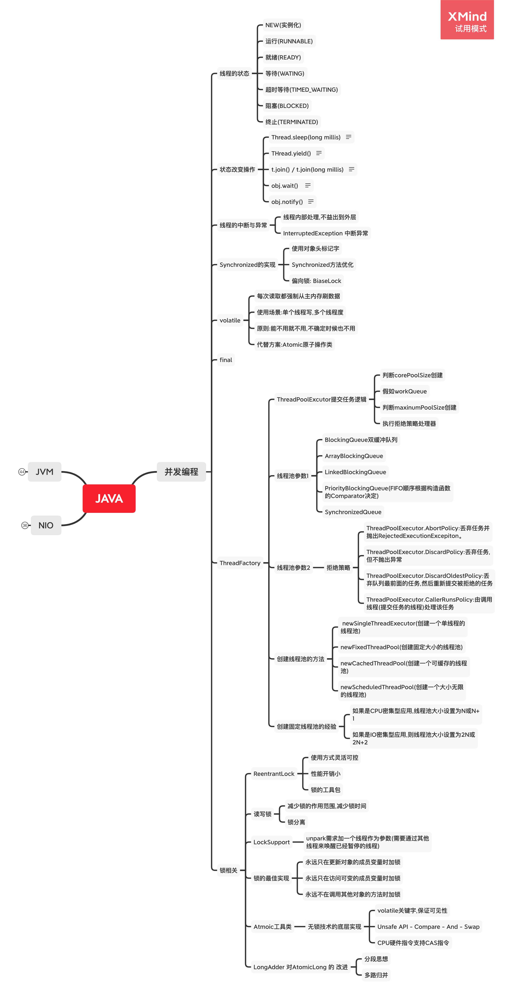

# 极客大学「Java进阶训练营-第0期」毕业总结

## JVM
  
    
JVM知识总结
1. Java字节码中指令中的算术运算与类型转换
2. 类加载: 类的生命周期7个步骤(加载->验证->准备->解析->初始化->使用->卸载),类的加载时机,类加载器机制。
3. JVM内存结构:堆,JVM栈,本地方法栈,非堆(方法区,CCS,Code Cache)
4. JDK内置命令行工具,JDK内置图形化工具
5. GC: Seial GC,Parallel GC, CMS,G1,ZGC,Shenandoah GC
6. JVM问题分析要素 : 分配速率,提升速率

## NIO
  

NIO知识总结
1. IO模型: 
    - 阻塞IO
    - 非阻塞IO
    - IO复用
    - 信号驱动IO
    - 异步IO
2. Netty
- 介绍:高性能网络异步框架
- 特性 
    - 高吞吐
    - 低延迟
    - 低开销 
    - 零拷贝
    - 可扩容
    - 松耦合
    - 可维护性好
- 基本概念:
    - Channel
    - ChannelFuture
    - Event & Handler
    - Encoder & Decoder 
    - ChannelPipeline
- 优化
    - 不能阻塞EventLoop
    - 系统参数优化
    - 缓冲区优化
    - 心跳周期优化
    - 内存与ByteBuffer优化
    - 其他优化

## 并发编程

  

1.线程的状态
    - 实例化(NEW)
    - 运行(RUNNABLE)
    - 就绪(READY)
    - 等待(WATING)
    - 超时等待(TIMED_WATING)
    - 阻塞(BLOCKED)
    - 终止(TERMINATED)
2. 状态改变操作
    - Thread.sleep(long millis)
    - Thread.yield()
    - t.join() / t.join(long millis)
    - obj.wait()
    - obj.notify()
3. 线程的中断与异常 
    - 线程内部处理,不益出到外层
    - InterruptedException 中断异常
4. Synchronize的实现
    - 使用对象头标记字
    - Synchronized方法优化
    - 偏向锁BiaseLock
5.JAVA关键字
    - volatile
      - 每次读取都强制从主内存刷数据
      - 使用场景:单个线程写,多个线程度
      - 原则:能不用就不用,不确定时候也不用
      - 代替方案:Atomic原子操作类
    - final
6. 线程池
    - 核心参数
      - 队列
        1. BlockingQueue双缓冲队列
        2. ArrayBlockingQueue
        3. LinkedBlockingQueue
        4. PriorityBlockingQueue(FIFO顺序根据构造函数的Comparator决定)
        5. SynchronizedQueue
      - 拒绝策略
        1. ThreadPoolExecutor.AbortPolicy:丢弃任务并抛出RejectedExecutionExcepiton。
        2. ThreadPoolExecutor.DiscardPolicy:丢弃任务,但不抛出异常
        3. ThreadPoolExecutor.DiscardOldestPolicy:丢弃队列最前面的任务,然后重新提交被拒绝的任务
        4. ThreadPoolExecutor.CallerRunsPolicy:由调用线程(提交任务的线程)处理该任务
    - 工厂方法
       -  newSingleThreadExecutor(创建一个单线程的线程池)
       -  newFixedThreadPool(创建固定大小的线程池)
       -  newCachedThreadPool(创建一个可缓存的线程池)
       -  newScheduledThreadPool(创建一个大小无限的线程池)
    - 创建固定线程池的经验
       - 如果是CPU密集型应用,线程池大小设置为N或N+1
       - 如果是IO密集型应用,则线程池大小设置为2N或2N+2
7. 锁相关
    - ReentrantLock
      1. 使用方式灵活可控
      2. 性能开销小
      3. 锁的工具包
    - 读写锁
      1. 减少所得作用范围,减少锁时间
      2. 锁分离
    - LockSupport
      1. unpark需求加一个线程作为参数(需要通过其他线程来唤醒已经暂停的线程)
    - 锁的最佳实践
      1. 永远只在更新对象的成员变量时加锁
      2. 永远只在访问可变的成员变量时加锁
      3. 永远不在调用其他对象的方法时加锁
    - Atmoic工具类
       - 无锁技术的底层实现
         1. volatile关键字,保证可见性
         2. Unsafe API - Compare - And - Swap
         3. CPU硬件指令支持CAS指令
       - LongAdder 对 AtmoicLong的改进
         1. 分段思想
         2. 多路归并