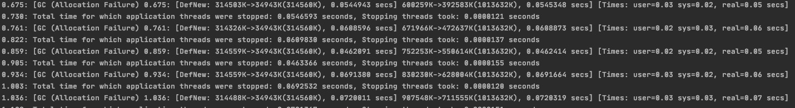
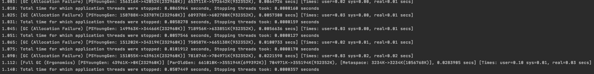
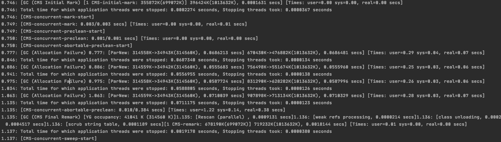
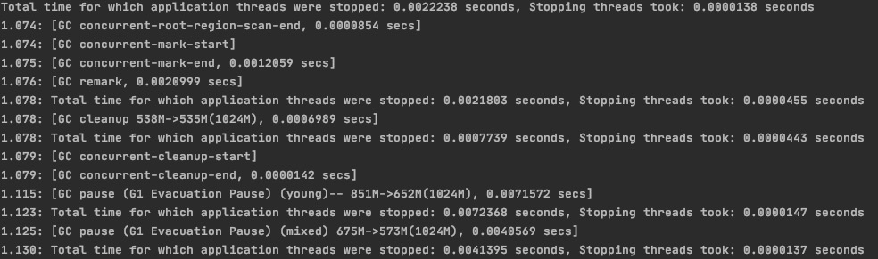
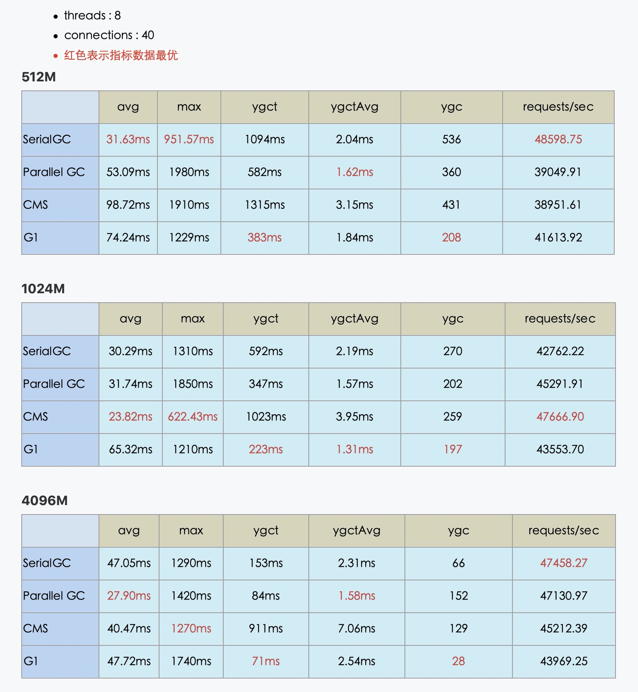
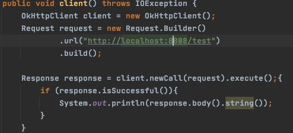

## 使用 GCLogAnalysis.java 自己演练一遍串行/并行/CMS/G1的案例

#### 运行内存1024M
- serialGC

 
 - `由于单线程执行GC可以看出相对的停顿时间约为14ms左右,比paralledGC的停顿时间要长`

- parallelGC

 - `多线程并发执行GC,停顿时间要比serialGC少得多，可以通过parallelGCThreads=N 来制定GC线程数,其默认值为CPU核心数`
  

- cmsGC

 - `cmsGC响应速度优先,整个周期可分为6阶段,`
 1. Initial Mark(初始标记),该阶段标记所有GC根对象的直接可达对象,可以观察到该阶段会有GC停顿时间
 2. Concurrent Mark(并发标记),跟程序并发运行,遍历标记所有对象
 3. Concurrent preclean(并发预处理),跟并发标记一样与程序并发运行,处理一些引用关系发生了变化的对象标记为脏卡
 4. Final Remark(最终标记),需要STW,完成老年代中所有存活对象的标记,确保之前标记的对象是否正确
 5. Concurrent Sweep(并发清除) 清理垃圾对象
 6. Concurrent Reset(并发重置) 收尾工作，为下次GC准备
 
- G1GC

- `G1 GC 最主要的设计目标是:将STW停顿的时间和分布,变成可预期且可配置的。另外在逻辑上不再区分年轻代和老年代,分成多个堆块,每个堆块可能是年轻代或老年代`

## 演练gateway-server-0.0.1-SNAPSHOT.jar所得测试数据

1. SerialGC: 在不同内存运行下都不比其他类型GC的吞吐量要低,甚至在较低内存下吞吐量与延迟时间数据相对较好,在较低运存下使用SerialGC或许是最佳的选择
2. ParallelGC: 在512M运存下充分利用多核CPU优势,GC暂停时间有明显提升,在1024M的平均GC时间与吞吐量也表现相对出色,到4096M内存可以说充分的体现出了ParallelGC的优点,高吞吐,GC暂停时长较短
3. CMS: 512M并没有体现出CMS的优势,在内存大于1024M时体现出了多线程并发标记和清除优势,并且延迟较低
4. G1:jvm默认情况下-XX:MaxGCPauseMillis=200,在三次不同运存下平均GC时间都是最短,并且次数最少,最大控制了GC的暂停时间与次数

## 写一段代码，使用HttpClient或OkHttp访问 http://localhost:8801

