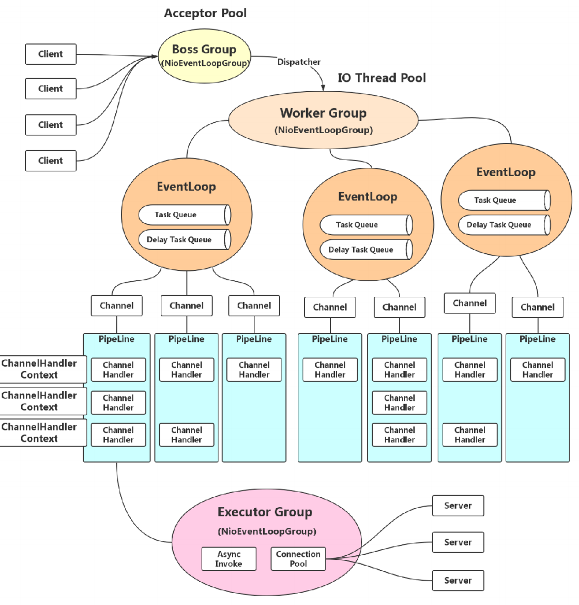
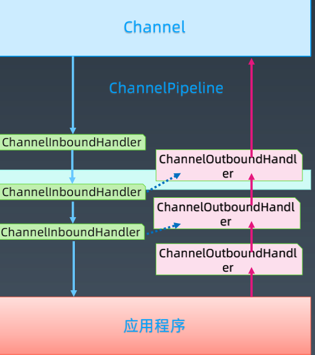

## 1、Netty总结
### 1# Netty介绍
    性质：网络应用开发框架  
    特点：1、异步 2、事件驱动 3、基于NIO
    场景：1、服务端 2、客户端 3、TCP/UDP  
   
### 2# Netty基本概念
    • Channel 通道,Java NIO中的基础概念,代表一个打开的连接,可执行读取/写入IO操作。Netty对CHannel的所有IO操作都是非阻塞的.
    • ChannelFuture Java的Future接口,只能查询操作的完成情况,或者阻塞当前线程等待操作完成。Netty封装一个ChannelFutrue接口。可以将回调方法传给ChannelFutrue,在操作完成时自动执行.
    • Event & Handler Netty基于事件驱动,事件和处理器可以关联到入站和出站数据流.
    • Encoder & Decoder 对IO进行序列化和返序列化,转换成Java对象与字节流。对入站数据进行解码,基类是ByteToMessageDecoder,对出站数据进行编码,基类是 MessageToByteEncoder.
    • ChannelPipeline 数据处理管道就是事件处理器链。有顺序,同一Channel的出站处理器和入站处理器在同一个列表中

### 3# Netty运行原理
 
    	

### 4# Netty关键对象
    • Bootstrap: 启动线程，开启 socket
    • EventLoopGroup: 线程池
    • EventLoop: 线程
    • SocketChannel: 连接
    • ChannelInitializer: 初始化
    • ChannelPipeline: 处理器链
    • ChannelHandler: 处理器
    
### 5# ChannelPipeline抽象
 
	
### 6# Event & Handler
    ·入站事件
        通道激活和停用
        读操作事件
        异常事件
        用户事件
    ·出站事件
        打开连接
        关闭连接
        写入数据
        刷新数据
    ·事件处理程序接口:
        ChannelHandler
        ChannelOutboundHandler
        ChannelInboundHandler
    ·适配器（空实现，需要继承使用）：
        ChannelInboundHandlerAdapter
        ChannelOutboundHandlerAdapter
        
7# Netty网络优化
   
    7.1) Nagle 与 TCP_NODELAY
        网络拥堵与Nagle算法优化TCP_NODELAY
        优化条件:
            缓冲区满
            达到超时
        
        MTU:Maxitum Transmission Unit
        最大传输单元(1500byte)
        
        MSS:Maxitum Segment Size
        最大分段大小(1460byte + 头与ip)
        
    7.2)粘包与拆包
        ByteToMessageDecoder提供的一些常见的实现类：
        1.FixedLengthFrameDecoder：定长协议解码器，我们可以指定固定的字节数算一个完整的报文
        2.LineBasedFrameDecoder：行分隔符解码器，遇到\n或者\r\n，则认为是一个完整的报文
        3.DelimiterBasedFrameDecoder：分隔符解码器，分隔符可以自己指定
        4.LengthFieldBasedFrameDecoder：长度编码解码器，将报文划分为报文头/报文体
        5.JsonObjectDecoder：json格式解码器，当检测到匹配数量的"{" 、”}”或”[””]”时，则认为是一个完整的json对象或者json数组
     
    7.3)Netty优化
        1.不能阻塞EventLoop
        2.系统参数优化 
            a.ulimit -a /proc/sys/net/ipv4/tcp_fim_timepout,TcpTimedWaitDelay
        3.缓冲区优化
            a.SO_RCVBUF/SO_SNDBUF/SO_BACKLOG/ REUSEXXX
        4.心跳周期优化
            a.心跳机制与短线重连
        5.内存与ByteBuffer优化
            a.DirectBuffer 与 HeapBuffer
        6.其他优化
            a.ioRatio
            b.Watermark
            c.TrafficShaping