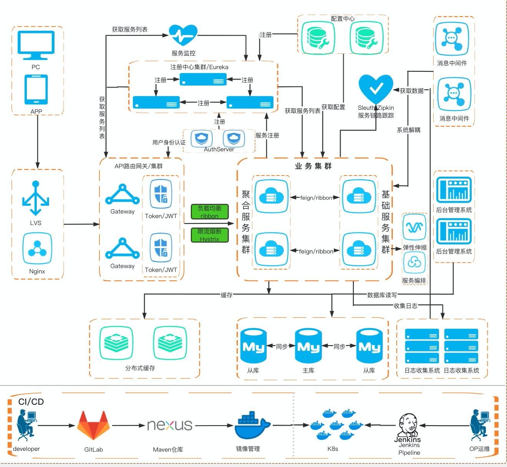

## 系统设计

### what

什么是秒杀？
 * 业务上:一场营销促销活动,具有明确的活动业务特点
 * 技术上:一种主动的DDos攻击,具备不确定性与复杂性 
 
### why

为什么要做秒杀?
* 活动促销,引流
* 增加用户活跃度
* 促进用户消费

#### who
具备那些业务模块?

* 用户:
用户信息,抢购资格过滤

* 商品:
商品信息展示

* 库存:
商品库存信息,固定的库存量，库存一致性保证

* 订单:
下单,退单,订单更新

* 支付
订单支付

### 架构设计

 

#### 流量预估
* 预约抢购

* UV统计

* 历史数据

* 宣传力度
* 产品定位

#### 限流

#####       前端限流

* 验证码

* 回答问题

* 随机访问到服务器

#####      服务端限流

* Nginx限流

* 容器
tomcat(设置并发数)，jetty

* 业务限流
  限流算法：令牌桶，漏桶

#### 服务稳定性

* 集群部署

* 备用节点预留

* 服务降级

* 模块划分
